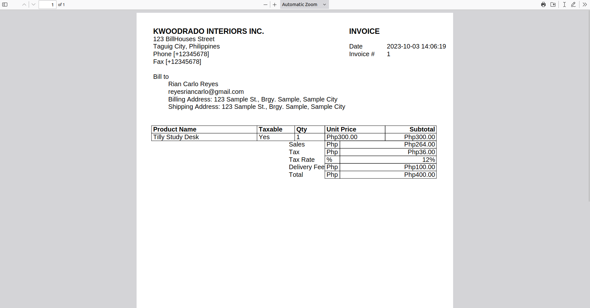
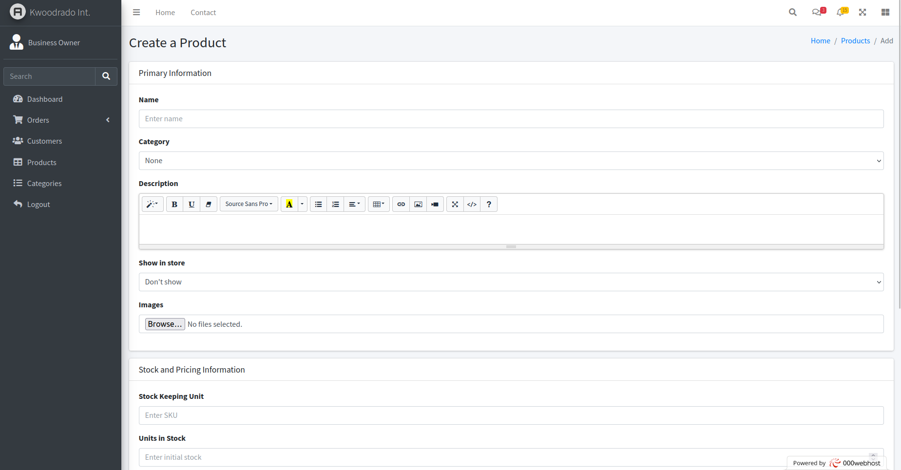

<!-- PROJECT SHIELDS -->
[![Stargazers][stars-shield]][stars-url]
[![Issues][issues-shield]][issues-url]

  <h3 align="center">Kwoodrado Interiors E-Commerce</h3>
  

    An E-Commerce made for selling wooden furniture.
  

## About the Project

Kwoodrado Interiors is an imaginary company that sells wooden furniture and
resells select items from Urban Concepts.

This website serves as an online store for the company, and to manage their
inventory and track orders.

### Components

1. **Front Store** - contains both the landing page and the store pages of
the website. These pages are what the customers see when they visit the
site and buy furniture.

1. **Administrator** - pages that the owner uses to manage the website.
Allows for E-Commerce administration tasks such as managing products,
inventory, and order tracking. Also comes with an analytics dashboard.

## Built With

This E-Commerce website is built with the following technologies:

[![PHP][PHP-shield]][PHP-docs]
[![MariaDB][MariaDB-shield]][MariaDB-docs]

### Database Structure

## Installation

Install the following beforehand:

1. XAMPP - includes both Apache Web Server and a MariaDB instance.

To make this run locally on your machine, do:

1. Download the repository, then extract it inside your XAMPP's htdocs folder. It should look like the following: 
`C:\path\to\xampp\htdocs\kwoodrado-interiors-ecommerce`.
1. Initialize your database by executing the `schema.sql` file on your DBMS. It already includes a CREATE DATABASE
statement with the name `kwoodrado_db` so simply plug the SQL file to create everything.
1. Create a `config.ini` file with the following keys: 
`db_server` - server IP address e.g `localhost:8000` 
`db_user` - dbms instance user associated with the application 
`db_password` - password of the user 
`db_name` - name of the database to be used by the application i.e `kwoodrado_db` 
Place this file inside your htdocs root folder, not inside your application. It should look like the following: 
`C:\path\to\xampp\htdocs\config.ini`
1. Finally, configure your XAMPP `DocumentRoot` setting to the application folder. Sample is the following: 
`DocumentRoot "C:/xampp/htdocs/kwoodrado-interiors-ecommerce"`

Then, the instance will now run on your local machine. Endpoints are: 
`localhost` - the index page of the application
`localhost/admin/dashboard.php` - dashboard. Should redirect you to a login form when not logged in yet.

## Store Pages

  
  
  

  
  
  

  
  
  

  
  
  

  
  

## Administrator Pages

  
  
  

  
  
  

  
  
  

  

(<a href="#readme-top">back to top</a>)

<!-- Markdown Links & Images -->
[stars-shield]: https://img.shields.io/github/stars/QueebSkeleton/kwoodrado-interiors-ecommerce?style=for-the-badge
[stars-url]: https://github.com/QueebSkeleton/kwoodrado-interiors-ecommerce/stargazers
[issues-shield]: https://img.shields.io/github/issues/QueebSkeleton/kwoodrado-interiors-ecommerce?style=for-the-badge
[issues-url]: https://github.com/QueebSkeleton/kwoodrado-interiors-ecommerce/issues

[PHP-shield]: https://img.shields.io/badge/php-%23777BB4.svg?style=for-the-badge&logo=php&logoColor=white
[PHP-docs]: https://www.php.net/
[MariaDB-shield]: https://img.shields.io/badge/MariaDB-003545?style=for-the-badge&logo=mariadb&logoColor=white
[MariaDB-docs]: https://mariadb.org/
